# Materials and Methods: Dual-Graph Heterogeneous GNN Pipeline for Crash-Risk Prediction

This document describes the full methodological pipeline — from raw
graph construction through model architecture, training, evaluation,
and post-hoc explanation — independent of any particular codebase's
internal file or variable naming. It is written to be dropped directly
into a Materials and Methods section. Every architectural choice below
is stated with its concrete value as actually used in this study, not
left as a free symbol.

---

## 1. Problem Formulation

Each candidate location $i$ in the study area is represented by a
binary label $y_i \in \{0, 1\}$ (crash-prone vs. not), and by **two
complementary graph representations** of its surroundings:

- an **egocentric graph** $G^{ego}_i$, built from a street-level
  (first-person) view of the location, capturing what an observer
  standing at the point would see; and
- an **allocentric graph** $G^{allo}_i$, built from a top-down,
  map-based view of the same location's surrounding built environment.

The task is to learn $f: (G^{ego}_i, G^{allo}_i) \mapsto \hat{y}_i \in
[0,1]$, and — beyond raw predictive performance — to establish *which*
part of each graph the model actually relies on when it predicts.

---

## 2. Data Representation and Acquisition

Both graphs are **heterogeneous**: they contain multiple node types
$\mathcal{T}_{node}$ and multiple edge relations $\mathcal{R}$, each
carrying its own feature schema and its own raw dimensionality, rather
than a single homogeneous node/edge type shared by the whole graph.
This section follows the pipeline in the order it actually runs: raw
data first (§2.1), negative-point generation (§2.2), then each graph's
own acquisition-to-construction path — egocentric via segmentation
(§2.3), allocentric via OpenStreetMap (§2.4) — followed by two
cross-cutting processing steps applied after both graphs exist
(§2.5–2.6).

### 2.1 Raw Data

Before any segmentation or graph construction happens, every candidate
location $i$ starts as nothing more than **one street-level image and
one geographic coordinate** — the same minimal starting point for both
classes:

- **Positive (crash) points** originate from recorded crash locations;
  each is matched to a street-level image captured as close as
  possible to the reported coordinate.
- **Negative (non-crash) points** have no independent record of their
  own — they must be deliberately generated to be geographically and
  distributionally comparable to the positives, rather than sourced
  from anywhere else (§2.2 covers exactly how).

Street-level images for both classes are retrieved with
[`streetlevel`](https://github.com/sk-zk/streetlevel), an open-source
package for querying and downloading street-level panorama imagery
given a target coordinate — the acquisition-distance filter used later
in negative sampling (§2.2, $\leq 10\,\text{m}$) is measured between
the requested coordinate and the position actually returned by this
retrieval step.

Only once a point has both a coordinate and a successfully acquired
image does it proceed to the two parallel construction pipelines: the
egocentric graph, built from the image via segmentation (§2.3), and the
allocentric graph, built from the coordinate via OpenStreetMap (§2.4).

### 2.2 Negative (Non-Crash) Point Sampling

Every positive (crash) location is paired with a comparably-sourced
**negative** location — a point with no recorded crash — so the task
is a genuine binary discrimination rather than a one-class density
estimate. Negatives are *generated*, not drawn from any independent
non-crash record, following six steps:

1. **Filter positives first.** Raw crash records are restricted to
   those with a successfully acquired street-view image within a fixed
   distance of the reported crash coordinate ($\leq 10\,\text{m}$
   acquisition distance) — this filtered positive set is what steps 2–4
   below are matched *against*, not the raw unfiltered record.
2. **Snap each retained positive to the road network.** The study
   area's drivable street network is fetched (constrained to the
   study-area boundary polygon, so it can never extend outside it —
   satisfying the geographic constraint directly, with no separate
   spatial-filter step needed later), projected to a local metric CRS,
   and every positive point is snapped to its nearest road edge, which
   also records that edge's road-classification tag (e.g. `residential`,
   `secondary`, `primary`...).
3. **Compute the positive set's road-type distribution.** The
   proportion of (now road-snapped) positives falling on each road
   classification becomes the **target distribution** for negative
   generation — e.g. if $30\%$ of positives snap to a `residential`
   road, $30\%$ of generated negatives are targeted at `residential`
   roads too.
4. **Availability quality-check before generating.** For each road
   type, the total available road length of that type is compared
   against how many negatives it would need to supply; a type with too
   little road length for its target count (implying negatives would
   have to cluster within an unrealistically short spacing) is flagged
   before generation proceeds, rather than silently producing
   near-duplicate points.
5. **Generate negatives by length-weighted sampling along matching
   road segments.** For each road type, candidate points are drawn by
   sampling edges of that type with probability proportional to each
   edge's length (so a longer segment is proportionally more likely to
   receive a point), then placing the point at a uniformly random
   position along the chosen edge. A generated point is accepted only
   if it falls **at least a minimum distance from every known positive
   point** (a deliberate safeguard so a "negative" can never
   coincidentally land on or immediately beside an actual crash
   location); rejected candidates are simply re-sampled until each
   road type's target count is met.
6. **Balance the total count.** The total number of negatives targeted
   equals the (filtered) positive count times a fixed ratio (used at
   $1{:}1$ in this study), split across road types according to step 3's
   distribution — so the *overall* class balance and the *per-road-type*
   composition are matched simultaneously, not just one or the other.

This road-type matching is a deliberate design decision, not
incidental: without it, the model could trivially learn "this road
classification alone predicts the label" as a shortcut confounded with
sampling artifact, rather than genuinely learning from the surrounding
visual/spatial evidence. Matching this one distribution up front closes
off that shortcut before training ever begins. Quality control includes
a spatial kernel-density comparison of positive vs. generated-negative
locations and a direct per-road-type proportion check confirming the
generated set actually hit its targets.

| Parameter | Value |
|---|---|
| SVI acquisition-distance filter | $\leq 10\,\text{m}$ |
| Road network type considered | drivable roads only (footways/cycleways excluded) |
| Negative : positive target ratio | $1{:}1$ |
| Minimum distance from any known positive | $10\,\text{m}$ |
| Low-availability QC threshold (avg. spacing) | $20\,\text{m}$ — flags a road type whose available length is too short to supply its target count without clustering |
| Resampling cap per road type | $20\times$ target count $+ 50$ attempts, before giving up and reporting a shortfall for that type |
| Random seed | fixed, for reproducibility |

**Worked example (one city).** After the $\leq 10\,\text{m}$ filter,
one city's positive set retained $1{,}860$ points, snapping to twelve
distinct road classifications. The dominant types and their resulting
targets:

| Road type | Positive proportion | Target negative count |
|---|---|---|
| residential | $30.1\%$ | $559$ |
| tertiary | $29.6\%$ | $550$ |
| primary | $16.5\%$ | $307$ |
| secondary | $13.5\%$ | $252$ |
| unclassified | $3.8\%$ | $70$ |
| living_street | $2.5\%$ | $46$ |
| *(six further minor types)* | $4.0\%$ combined | $76$ combined |

Generation reached the full $1{,}860$ target with every road type's
realized proportion matching its target proportion to within
rounding — confirmed directly by comparing the generated set's own
`value_counts()` against the target distribution before export.

**Illustration — length-weighted sampling with minimum-distance
rejection**, for one road type's edge set:

<svg viewBox="0 0 520 220" width="500" height="220" xmlns="http://www.w3.org/2000/svg" font-family="sans-serif">
  <line x1="30" y1="60" x2="200" y2="60" stroke="#888" stroke-width="4"/>
  <line x1="210" y1="60" x2="290" y2="60" stroke="#888" stroke-width="4"/>
  <line x1="300" y1="60" x2="490" y2="60" stroke="#888" stroke-width="4"/>
  <text x="115" y="45" text-anchor="middle" font-size="11" fill="#555">edge A (long -&gt; high sampling weight)</text>
  <text x="250" y="45" text-anchor="middle" font-size="11" fill="#555">edge B (short)</text>
  <text x="395" y="45" text-anchor="middle" font-size="11" fill="#555">edge C (long)</text>
  <circle cx="80" cy="60" r="5" fill="#2e7d32"/>
  <circle cx="150" cy="60" r="5" fill="#2e7d32"/>
  <circle cx="420" cy="60" r="5" fill="#2e7d32"/>
  <text x="80" y="90" text-anchor="middle" font-size="10" fill="#2e7d32">accepted</text>
  <text x="150" y="90" text-anchor="middle" font-size="10" fill="#2e7d32">accepted</text>
  <text x="420" y="90" text-anchor="middle" font-size="10" fill="#2e7d32">accepted</text>
  <circle cx="255" cy="60" r="10" fill="none" stroke="#d32f2f" stroke-width="1.5" stroke-dasharray="3 2"/>
  <circle cx="255" cy="60" r="5" fill="#d32f2f"/>
  <circle cx="255" cy="105" r="7" fill="#c62828" stroke="#7a1313" stroke-width="1.5"/>
  <text x="248" y="135" text-anchor="middle" font-size="10" fill="#7a1313">known positive</text>
  <text x="255" y="150" text-anchor="middle" font-size="10" fill="#d32f2f">candidate within min-distance</text>
  <text x="255" y="163" text-anchor="middle" font-size="10" fill="#d32f2f">-&gt; rejected, resample</text>
  <text x="260" y="200" text-anchor="middle" font-size="12" fill="#111">P(edge chosen) &#8733; edge length; point placed at a uniform random fraction along it</text>
</svg>

Once generated, a negative point is carried through **the exact same**
downstream pipeline as a positive point — image capture, metadata
reconciliation, out-of-range filtering, egocentric/allocentric graph
construction (§2.3–2.4) — with no label-dependent branching anywhere in
that process, so the label itself never leaks into how a point's graph
gets built.

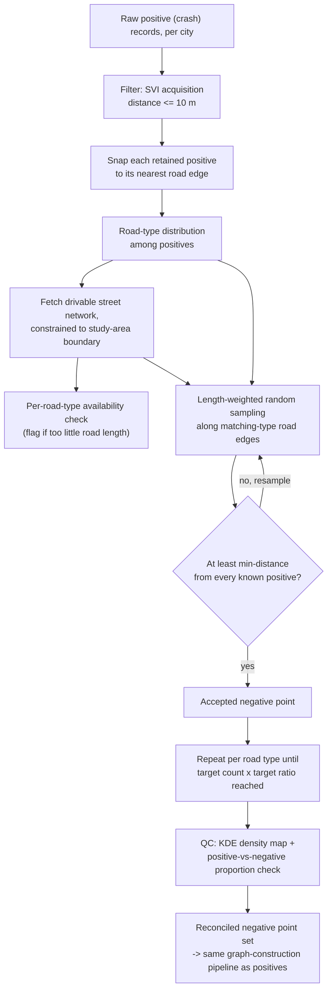

### 2.3 Egocentric Graph: Segmentation to Graph Generation

#### 2.3.1 Segmentation

Object nodes are extracted via **panoptic segmentation** (Mask2Former,
Swin-Large backbone, fine-tuned on the Mapillary Vistas v1.2
taxonomy — 65 classes), run at each image's native resolution.
Mapillary's classes split into "thing" classes (countable objects the
model already instances individually — traffic lights, poles, signs,
banners, billboards) and "stuff" classes (amorphous regions the model
fuses into one segment per class — buildings, vegetation, crosswalks,
lane markings); stuff segments are re-split into individual object
nodes via connected-component labeling on their fused mask, so multiple
buildings or a dashed lane marking in one frame become separate nodes
rather than one blob. Detected regions below a minimum pixel-area
threshold are discarded.

| Node type | Source segmentation classes |
|---|---|
| `signage` | Traffic Sign Frame/Front/Back, Banner, Billboard |
| `light_pole` | Traffic Light, Street Light, Pole, Utility Pole |
| `road_marking` | Crosswalk (plain), Lane marking (general) |
| `building` | Building |
| `vegetation` | Vegetation |

Viewpoint-level features (sky-view factor, enclosure index, visual
entropy) are computed directly from the full per-pixel segmentation
map, not from any single detected object instance.

**Sky-View Factor** — the fraction of the **entire** image that is
classified as "Sky":

$$
\text{SVF} = \frac{\text{number of sky pixels}}{\text{total number of pixels in the image}}
$$

**Enclosure Index** — the same idea, but for a fixed set of
"enclosure" classes (buildings, walls, fences, vegetation, and every
pole/sign/light class — everything that can wall in a street), and
counted only within the **top 40% of the image by height** rather than
the whole frame, so it captures overhead/vertical enclosure instead of
being diluted by an open road surface at the bottom:

$$
\text{Enclosure} = \frac{\text{number of enclosure-class pixels in the top 40\% crop}}{\text{total number of pixels in that top 40\% crop}}
$$

**Visual Entropy** — the Shannon entropy of how the image's pixels are
split across classes. First, for every class $c$ present in the image,
compute its share of all pixels:

$$
p_c = \frac{\text{number of pixels of class } c}{\text{total number of pixels in the image}}
$$

then combine those shares into one entropy value:

$$
\text{Entropy} = -\sum_{c} p_c \log p_c
$$

A frame dominated by one or two classes (e.g. mostly road and sky) has
low entropy; a visually cluttered frame spread across many classes has
high entropy. This is entropy over *pixel proportion per class*, not
over individual object instances — ten small signage instances
contribute to the same $p_c$ as one large one, since what's being
measured is how visually "busy" the frame is, not how many discrete
objects are in it.

Object-node position/area come from each detected instance's own pixel
mask; its categorical class field records which specific source class
produced that instance.

**What each node type consists of, directly from the segmentation
output above:**

- **viewpoint**: consists of sky-view factor, spatial enclosure, visual
  entropy, and the fixed image-frame position $(x,y)$ — $5$ dimensions,
  exactly one node per graph, computed from the whole segmentation map
  rather than from any single detected instance.
- **signage**: one node per surviving `signage`-mapped instance
  (Traffic Sign Frame, Traffic Sign Front, Traffic Sign Back, Banner,
  or Billboard); consists of that instance's normalized position $(2)$,
  normalized mask area $(1)$, and a categorical class embedding
  ($d_{cls}=4$) recording which of those five source classes it was —
  $7$ dimensions total.
- **light_pole**: one node per surviving `light_pole`-mapped instance
  (Traffic Light, Street Light, Pole, or Utility Pole); consists of
  position, area, and a class embedding over those four source
  classes — $7$ dimensions total.
- **road_marking**: one node per connected component of a fused
  `road_marking`-mapped "stuff" mask (Crosswalk (plain) or Lane
  marking (general)); consists of position, area, and a class
  embedding over those two source classes — $7$ dimensions total.
- **building**: one node per connected component of the fused
  `Building` "stuff" mask; consists of normalized position $(2)$ and
  normalized mask area $(1)$ only — $3$ dimensions total; no class
  embedding, since this node type maps to only one source segmentation
  class.
- **vegetation**: one node per connected component of the fused
  `Vegetation` "stuff" mask; consists of position and area only — $3$
  dimensions total, same reasoning as `building`.

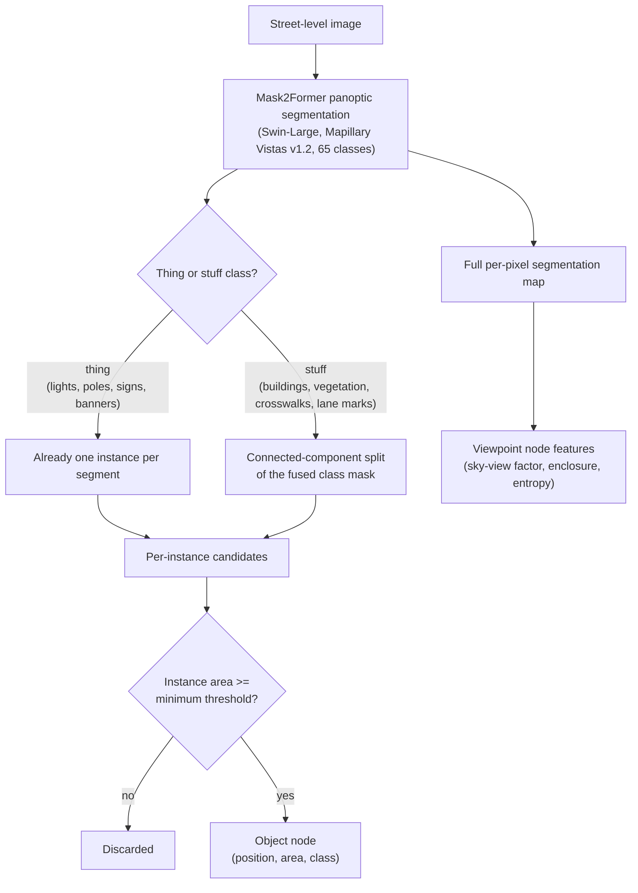

**Illustration — Sky-View Factor.** SVF is the fraction of the
**entire** image frame classified as "Sky," not a cropped region (that
crop applies only to the Enclosure Index, computed over the top 40% of
the frame — a different metric, easily confused with SVF):

<svg viewBox="0 0 480 340" width="480" height="340" xmlns="http://www.w3.org/2000/svg" font-family="sans-serif">
  <rect x="0" y="0" width="480" height="320" fill="#4a4f42"/>
  <polygon points="0,0 480,0 480,70 440,70 440,140 400,140 400,55 330,55 330,150 220,150 220,50 140,50 140,160 60,160 60,90 0,90" fill="#bfe0f2" stroke="#7fb8d6" stroke-width="1"/>
  <line x1="0" y1="128" x2="480" y2="128" stroke="#ffcf4d" stroke-width="1.5" stroke-dasharray="6 4"/>
  <text x="8" y="122" fill="#ffcf4d" font-size="12">top 40% crop boundary (used by Enclosure Index only)</text>
  <text x="180" y="30" fill="#1c4b63" font-size="14" font-weight="bold">Sky</text>
  <text x="330" y="230" fill="#ffffff" font-size="13">Buildings / poles / vegetation / road</text>
  <text x="330" y="248" fill="#ffffff" font-size="13">(excluded from SVF numerator)</text>
  <rect x="0" y="320" width="480" height="20" fill="none"/>
  <text x="240" y="335" text-anchor="middle" fill="#111" font-size="13">SVF = (sky pixels) / (total image pixels) — computed over the WHOLE frame above</text>
</svg>

#### 2.3.2 Graph Generation

**Node types and raw feature dimensionality.**

| Node type | Raw feature vector | Raw dim |
|---|---|---|
| viewpoint (1 per graph) | sky-view factor, spatial enclosure, visual entropy, image-frame position $(x,y)$ | $5$ |
| object type with $\geq 2$ subclasses (e.g. signage, poles, road markings) | normalized position $(2)$ + normalized mask area $(1)$ + categorical class embedding $(d_{cls})$ | $3 + d_{cls}$ |
| object type with 1 subclass (e.g. buildings, vegetation, in this graph) | normalized position $(2)$ + normalized mask area $(1)$ | $3$ |

The categorical class embedding dimension is $d_{cls} = 4$, and its
vocabulary size is set per object type from the number of distinct
segmentation classes observed for that type (typically small, e.g.
4–5 classes). See §2.3.1 for what each node type consists of.

**Edge relations.** The three relation *names* each expand into
several concrete node-type-pair connections, not one single "any
object to any object" wire — and their attribute dimensionality
differs by relation, not a uniform scalar throughout:

| Relation | Node-type pairs actually connected | Attribute (raw dim) | Trigger condition |
|---|---|---|---|
| *sees* | viewpoint $\leftrightarrow$ **every** one of the 5 object types (always present, not thresholded) | $[$normalized object area, normalized viewpoint$\to$object distance$]$ — $2$ | none — dense, every object gets a `sees` edge |
| *mounted-on* | `signage`$\leftrightarrow$`signage`, `light_pole`$\leftrightarrow$`light_pole`, `signage`$\leftrightarrow$`light_pole` **only** — never `road_marking`, `building`, or `vegetation` | bounding-box overlap ratio — $1$ (informative when present, but *not* the trigger) | centroid distance $\leq$ a small threshold (fraction of image diagonal); bounding-box overlap is **not** required |
| *near* | every pairwise combination among **all 5** object types, including same-type pairs ($15$ type-pair combinations total) | normalized centroid distance — $1$ | centroid distance $\leq$ a looser threshold than *mounted-on*'s |

Every relation is stored **bidirectionally** — both directions of each
qualifying pair are added as explicit edges, not left for the model to
infer via symmetry. Distance for *mounted-on* and *near* is the
Euclidean distance between object centroids divided by the image
diagonal (aspect-ratio-safe, unlike a naive per-axis normalization);
*sees*'s distance is measured the same way, from each object's
centroid to the fixed viewpoint position.

*mounted-on* is deliberately narrower in scope than *near* and uses a
much smaller distance threshold, so the two relations capture
materially different things rather than one being a subset of the
other by accident: *mounted-on* targets "physically co-located on the
same support" (e.g. a sign and a light mounted on the same pole),
while *near* already covers general spatial proximity, at a looser
threshold, across every object type — including the three types
(`road_marking`, `building`, `vegetation`) that *mounted-on* never
touches at all.

### 2.4 Allocentric Graph: OpenStreetMap Acquisition to Graph Generation

#### 2.4.1 Acquisition

Building footprints (tag `building=*`) and the street network are
fetched via the Overpass API and reprojected to a local metric (UTM)
coordinate system; building type is OSM's own tag value, pooled across
the whole dataset into one shared vocabulary with rare/noisy values
collapsed into an "other" bucket (kept distinct from untagged
"unknown"). Intersection features (betweenness centrality, orientation
entropy) are computed once over the full street-network graph. Road
type is OSM's `highway=*` tag of the nearest street segment.

**The six building geometric descriptors, with their equations.** All
six are computed directly from each footprint polygon $P$; the last
three additionally use $R$, $P$'s minimum-area rotated bounding
rectangle, with side lengths $s_1 \le s_2$ and edge-direction vector
$(\Delta x, \Delta y)$ along $R$'s first side:

$$
\text{Area} = \text{area}(P), \qquad \text{Perimeter} = \text{length}(\partial P)
$$

$$
\text{Compactness} = \frac{4\pi \cdot \text{Area}}{\text{Perimeter}^2}
$$

$$
\text{Elongation} = \frac{s_1}{s_2} \in (0,1]
$$

$$
\text{Orientation} = \Big(\text{atan2}(\Delta y, \Delta x)\cdot\frac{180}{\pi}\Big) \bmod 180°
$$

$$
\text{Shape Index} = \frac{\text{Area}(P)}{\text{Area}(R)}
$$

**Area** and **Perimeter** are the footprint's own size; **Compactness**
is a circularity ratio ($1.0$ for a perfect circle, decreasing toward
$0$ as the shape becomes more elongated or irregular — the *same*
formula reused below for the isovist polygon); **Elongation** is how
stretched the footprint's bounding rectangle is (near $1$ for a square
footprint, near $0$ for a long thin one); **Orientation** is that
rectangle's compass angle, folded into $[0°,180°)$ since a building's
long axis has no meaningful "front" direction; **Shape Index** is how
much of its own bounding rectangle the footprint actually fills (near
$1$ for a simple rectangular footprint, lower for an irregular or
L-shaped one).

**Occlusivity** — defined only for the isovist polygon (below), as the
fraction of the $n$ cast rays that were *triggered* (stopped by a
building) rather than reaching the full search radius unobstructed:

$$
\text{Occlusivity} = \frac{1}{n} \sum_{k=1}^{n} \mathbb{1}\big[\text{ray}_k \text{ triggered by a building}\big]
$$

where $\mathbb{1}[\cdot]$ is the indicator function ($1$ if that ray
was triggered, $0$ if it reached the radius unobstructed) — a direct
proxy for how visually enclosed the location is: $\text{Occlusivity}
\to 1$ means nearly every direction is blocked nearby, $\text{Occlusivity}
\to 0$ means the point sits in open, unobstructed space. The isovist
polygon's own **Area** and **Compactness** reuse the same two
equations above, applied to the ray-cast polygon instead of a building
footprint.

**What each node type consists of:**

- **focal**: consists of segment position $(1)$, isovist area $(1)$,
  isovist compactness $(1)$, isovist occlusivity $(1)$, and a
  road-type embedding ($d_{hw}=8$) — $4+d_{hw}=12$ dimensions total;
  exactly one node per graph.
- **building**: one node per OSM building footprint within range;
  consists of the six geometric descriptors above, a building-type
  embedding ($d_{bt}=32$), and two missing-aware continuous
  projections (height, storey count — each $d_{miss}=4$, §2.5) —
  $6+d_{bt}+2d_{miss}=46$ dimensions total.
- **intersection**: one node per street-network junction within range;
  consists of betweenness centrality and orientation entropy only —
  $2$ dimensions total.
- **peer** (ablation-only): one node per nearby prior incident;
  consists of a single constant placeholder — $1$ dimension, no
  independently-measured attributes at all.

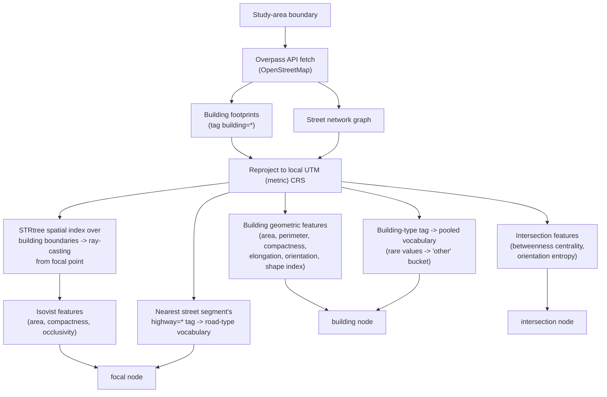

**Illustration — isovist construction and its ray/building
"triggering" logic.** From the focal point, $n$ rays are cast at evenly
spaced angles across the full $360°$. Testing every ray against every
building footprint in the study area individually would be far too
slow at this scale (potentially thousands of rays, across many
candidate points, each against every nearby building); instead, an
**STRtree** — an R-tree-based spatial index, built once over every
building boundary — lets each ray query the index directly for only
the small set of candidate buildings whose bounding box could possibly
intersect it, rather than checking every building in the study area
one by one. Exact ray-polygon intersection is then computed only
against that short candidate list, and if any intersection exists, the
ray is **triggered** (stopped) at the *closest* such intersection
point — not the first candidate the index happens to return, but
whichever intersection point is nearest the focal point. A ray whose
candidate list yields no intersection at all is left un-triggered and
extends to the full search radius. The isovist polygon is then the
polygon connecting every ray's endpoint, in angular order — its three
summary features (area, compactness, occlusivity) are all computed
from this one polygon plus the per-ray triggered/un-triggered flags:

<svg viewBox="0 0 480 480" width="440" height="440" xmlns="http://www.w3.org/2000/svg" font-family="sans-serif">
  <circle cx="240" cy="240" r="190" fill="none" stroke="#999" stroke-width="1.5" stroke-dasharray="5 5"/>
  <text x="240" y="42" text-anchor="middle" fill="#777" font-size="12">search radius</text>
  <polygon points="430,240 404.5,335 290,326.6 240,430 145,404.5 153.4,290 50,240 75.5,145 195,162.1 240,50 335,75.5 335.3,185" fill="#ffd54d" fill-opacity="0.35" stroke="#e0a800" stroke-width="2"/>
  <line x1="240" y1="240" x2="430" y2="240" stroke="#4a90d9" stroke-width="1.5"/>
  <line x1="240" y1="240" x2="404.5" y2="335" stroke="#4a90d9" stroke-width="1.5"/>
  <line x1="240" y1="240" x2="290" y2="326.6" stroke="#d9534f" stroke-width="1.5"/>
  <line x1="240" y1="240" x2="240" y2="430" stroke="#4a90d9" stroke-width="1.5"/>
  <line x1="240" y1="240" x2="145" y2="404.5" stroke="#4a90d9" stroke-width="1.5"/>
  <line x1="240" y1="240" x2="153.4" y2="290" stroke="#d9534f" stroke-width="1.5"/>
  <line x1="240" y1="240" x2="50" y2="240" stroke="#4a90d9" stroke-width="1.5"/>
  <line x1="240" y1="240" x2="75.5" y2="145" stroke="#4a90d9" stroke-width="1.5"/>
  <line x1="240" y1="240" x2="195" y2="162.1" stroke="#d9534f" stroke-width="1.5"/>
  <line x1="240" y1="240" x2="240" y2="50" stroke="#4a90d9" stroke-width="1.5"/>
  <line x1="240" y1="240" x2="335" y2="75.5" stroke="#4a90d9" stroke-width="1.5"/>
  <line x1="240" y1="240" x2="335.3" y2="185" stroke="#d9534f" stroke-width="1.5"/>
  <rect x="270" y="300" width="55" height="45" fill="#555" stroke="#333"/>
  <rect x="128" y="265" width="55" height="45" fill="#555" stroke="#333"/>
  <rect x="168" y="128" width="55" height="45" fill="#555" stroke="#333"/>
  <rect x="308" y="150" width="55" height="45" fill="#555" stroke="#333"/>
  <text x="297" y="325" text-anchor="middle" fill="#fff" font-size="11">building</text>
  <text x="155" y="290" text-anchor="middle" fill="#fff" font-size="11">building</text>
  <text x="195" y="153" text-anchor="middle" fill="#fff" font-size="11">building</text>
  <text x="335" y="175" text-anchor="middle" fill="#fff" font-size="11">building</text>
  <circle cx="290" cy="326.6" r="4" fill="#d9534f"/>
  <circle cx="153.4" cy="290" r="4" fill="#d9534f"/>
  <circle cx="195" cy="162.1" r="4" fill="#d9534f"/>
  <circle cx="335.3" cy="185" r="4" fill="#d9534f"/>
  <circle cx="240" cy="240" r="7" fill="#111"/>
  <text x="240" y="225" text-anchor="middle" fill="#111" font-size="12" font-weight="bold">focal point</text>
  <text x="15" y="470" fill="#4a90d9" font-size="12">— blue ray: reaches search radius unobstructed</text>
  <text x="15" y="455" fill="#d9534f" font-size="12">— red ray: triggered by nearest building intersection</text>
</svg>

The shaded region is the isovist polygon actually used downstream;
**area**, **compactness** ($4\pi\cdot\text{area}/\text{perimeter}^2$),
and **occlusivity** (fraction of red vs. blue rays) are all read off
directly from this one construction.

#### 2.4.2 Graph Generation

**Node types and raw feature dimensionality.**

| Node type | Raw feature vector | Raw dim |
|---|---|---|
| focal (1 per graph) | segment position $(1)$, isovist area $(1)$, isovist compactness $(1)$, isovist occlusivity $(1)$, road-type embedding $(d_{hw})$ | $4 + d_{hw}$ |
| building | footprint area, perimeter, compactness, elongation, orientation, shape index $(6)$, building-type embedding $(d_{bt})$, height projection $(d_{miss})$, storey-count projection $(d_{miss})$ | $6 + d_{bt} + 2 d_{miss}$ |
| intersection | betweenness centrality, orientation entropy | $2$ |
| peer (ablation-only) | constant placeholder (no independent attributes) | $1$ |

with $d_{hw} = 8$ (road-type embedding), $d_{bt} = 32$ (building-type
embedding — sized against a pooled, multi-source vocabulary of **229**
raw categories, after rare categories below a pooled-frequency
threshold are collapsed into a shared "other" bucket, kept distinct
from "missing/untagged"), and $d_{miss} = 4$ (output width of the
missing-aware continuous projection, §2.5). See §2.4.1 for what each
node type consists of.

**Edge relations.**

| Relation | Connects | Raw attribute dim |
|---|---|---|
| *anchors* | focal $\leftrightarrow$ building / intersection | $1$ (distance) |
| *adjacent* | building $\leftrightarrow$ building | $1$ (shared-boundary metric) |
| *connects* | intersection $\leftrightarrow$ intersection | $4$ (street-segment attributes) |
| *fronts* | building $\leftrightarrow$ intersection | $1$ (distance) |
| *on-segment* | focal $\leftrightarrow$ intersection | $5$ (segment position + road-type) |
| *peer-history* (ablation only) | focal $\leftrightarrow$ peer | $1$ (proximity) |

For *connects* and *on-segment*, one raw dimension is itself a
categorical road-type index, which is embedded ($d_{hw}=8$) and
concatenated with the remaining raw dimensions before being consumed
by the attention mechanism — so their **effective** post-embedding
edge-attribute dimensionality is $(4-1)+8=11$ and $(5-1)+8=12$
respectively.

### 2.5 Feature Preprocessing: Missing Values and Normalization

Two cross-cutting steps are applied after both graphs are constructed
(§2.3–2.4) and before either is consumed by the model (§3).

**Missing-value handling.** Continuous attributes that may be absent
for a given entity (e.g. building height, storey count) are never
mean-imputed or zero-filled. Instead, each such field is passed
through a **missing-aware projection** with output width $d_{miss} = 4$:

$$
h_v^{cont} =
\begin{cases}
W_{proj}\, x_v + b_{proj} & \text{if } x_v \text{ is observed} \\[4pt]
p_{learned} & \text{if } x_v \text{ is missing}
\end{cases}, \qquad W_{proj} \in \mathbb{R}^{4 \times 1},\ p_{learned} \in \mathbb{R}^{4}
$$

where $p_{learned}$ is a single learned placeholder vector shared
across all instances of that field, trained jointly with the rest of
the network. This lets the model distinguish "this value is genuinely
absent" from any real observed value, rather than conflating
missingness with a specific number.

**Normalization.** Continuous node/edge attributes are standardized
($z$-score) using statistics fit **only on the training partition** of
each data split, then applied unchanged to validation and test
partitions — preventing information leakage from held-out data into
the normalization itself.

---

## 3. Model Architecture

### 3.1 Categorical and Continuous Feature Embedding

Every categorical field $c$ (object class, building type, road type)
is mapped through a learned embedding table:

$$
e_c = \text{Embed}_c(c) \in \mathbb{R}^{d_c}
$$

with $d_{c} \in \{4 \text{ (object class)},\ 32 \text{ (building type)},\ 8 \text{ (road type)}\}$
depending on the field, as introduced in §2.3.2–2.4.2.

For each node type $\tau$, the raw feature vector (dimensionalities in
§2.3.2–2.4.2) is linearly projected into a **shared hidden dimension**
$d_h = 128$, per node type:

$$
h_v^{(0)} = W_{\tau(v)}\, x_v + b_{\tau(v)}, \qquad W_{\tau(v)} \in \mathbb{R}^{128 \times \dim(x_v)}
$$

Every node type has its own projection matrix, since raw feature
dimensionality differs by type (§2.3.2–2.4.2 tables).

### 3.2 Heterogeneous Graph Attention Layers

Message passing is performed with **relation-specific Graph Attention
(GATv2)** convolutions (Brody et al., 2022), one attention mechanism
per edge relation, combined via sum-aggregation across relations —
following the standard heterogeneous-GNN pattern. Both graphs use:

| Parameter | Value |
|---|---|
| Hidden dimension $d_h$ | $128$ |
| Number of message-passing layers $L$ | $2$ |
| Attention heads $H$ | $4$ (per-head dimension $= d_h / H = 32$) |
| Dropout (encoder) | $0.3$ |

For a directed edge $(u \to v)$ under relation $r$, the (unnormalized)
attention logit is:

$$
s_{uv}^{r} = a_r^\top\, \text{LeakyReLU}\big(W_1^r h_u + W_2^r h_v + W_e^r\, e_{uv}\big)
$$

normalized over $v$'s neighborhood under relation $r$:

$$
\alpha_{uv}^{r} = \frac{\exp(s_{uv}^{r})}{\displaystyle\sum_{w \,\in\, \mathcal{N}_r(v)} \exp(s_{wv}^{r})}
$$

with $H=4$ independent attention heads computed in parallel and
concatenated (each head's output dimension $128/4=32$, concatenated
back to $128$). The per-relation message is:

$$
m_v^{r} = \sum_{u \,\in\, \mathcal{N}_r(v)} \alpha_{uv}^{r}\, W^r h_u
$$

and one layer's full update sums every applicable relation's message,
then applies normalization, a nonlinearity, and dropout:

$$
h_v^{(\ell)} = \text{Dropout}_{0.3}\Big(\text{ELU}\big(\text{LayerNorm}\big(\textstyle\sum_{r \,\in\, \mathcal{R}(v)} m_v^{r}\big)\big)\Big), \qquad \ell = 1, 2
$$

### 3.3 Graph-Level Readout

After $L=2$ layers, the variable-size set of node embeddings collapses
into one fixed-size graph vector. The readout used throughout this
study concatenates a type-aggregated pooling term with the **anchor
node's own final embedding** (the viewpoint node for the egocentric
graph, the focal node for the allocentric graph):

$$
z = \left[\; \sum_{\tau \,\in\, \mathcal{T}_{node}} \text{MeanPool}\big(\{h_v^{(L)} : \tau(v) = \tau\}\big) \;\middle\|\; h_{anchor}^{(L)} \;\right] \in \mathbb{R}^{2 d_h} = \mathbb{R}^{256}
$$

This guarantees the anchor's own representation is always present in
$z$, by construction — a property later tested directly in the
explainability stage (§7).

### 3.4 Fusion Projection and Classifier Head

Every scheme (§4) projects its graph vector(s) to a common **fusion
dimension** $d_{fuse} = 256$ before the head, then passes the
(possibly-combined) $d_{fuse}$-vector through a two-layer MLP to a
single logit:

$$
\text{logit} = W_2\, \text{Dropout}_{0.5}\big(\text{ReLU}(W_1 z + b_1)\big) + b_2
$$

| Parameter | Value |
|---|---|
| Fusion projection dimension $d_{fuse}$ | $256$ |
| Classifier hidden width | $256$ |
| Classifier dropout | $0.5$ |
| $W_1$ shape | $256 \times d_{in}$ ($d_{in}$ = classifier input width, §4.8) |
| $W_2$ shape | $1 \times 256$ |

### 3.5 Loss Function

Training minimizes numerically-stable binary cross-entropy directly on
the logit:

$$
\mathcal{L} = -\frac{1}{N}\sum_{i=1}^{N} \Big[ y_i \log \sigma(\text{logit}_i) + (1 - y_i)\log\big(1 - \sigma(\text{logit}_i)\big) \Big]
$$

---

## 4. Modeling Schemes A–G

Every scheme below shares the same encoder architecture (§3.1–3.3,
$d_h{=}128$, $H{=}4$ heads, $L{=}2$ layers) and classifier head
(§3.4, hidden width $256$, dropout $0.5$); they differ **only** in how
the egocentric and allocentric representations are combined, giving a
controlled, single-variable comparison across fusion strategies. G is
the sole non-graph baseline.

### 4.1 Scheme A — Egocentric only

*Rationale: isolates how much predictive signal exists in street-level
visual context alone, independent of any map-based information.*

$$
z = z^{ego} \in \mathbb{R}^{256}, \qquad \text{logit} = \text{Head}(z^{ego})
$$

Classifier input width $d_{in} = 256$.

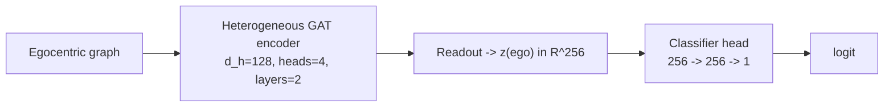

### 4.2 Scheme B — Allocentric only

*Rationale: isolates how much predictive signal exists in the
built-environment/map context alone, independent of street-level
appearance — the mirror-image control to Scheme A.*

$$
z = z^{allo} \in \mathbb{R}^{256}, \qquad \text{logit} = \text{Head}(z^{allo})
$$

Classifier input width $d_{in} = 256$.

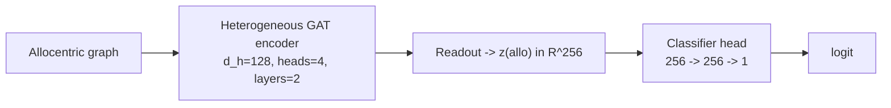

### 4.3 Scheme C — Early fusion (concatenation)

*Rationale: the simplest way to combine both views — tests whether
naively pooling both representations already improves over either view
alone (A/B), before trying anything more elaborate.*

Both graphs are encoded independently, each projected to $d_{fuse}=256$,
then concatenated **before** the classifier head sees either
representation:

$$
z = \big[\, \text{proj}(z^{ego}) \,\|\, \text{proj}(z^{allo}) \,\big] \in \mathbb{R}^{512}, \qquad \text{logit} = \text{Head}(z)
$$

Classifier input width $d_{in} = 512$ (the only structural difference
from A/B's head: the first MLP layer is $512 \to 256$ instead of
$256 \to 256$).

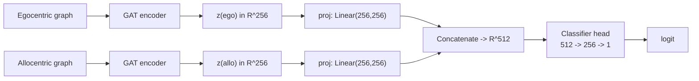

### 4.4 Scheme D — Late fusion (decision-level)

*Rationale: tests whether letting each view reach its own independent
decision first, blending only at the final logit, works better than
blending their representations earlier (C) — useful when the two views
disagree or are unevenly reliable.*

Each branch is encoded **and classified independently** by its own
$256 \to 256 \to 1$ head, producing two separate logits; a learned
$1{\times}2$ combination layer merges them:

$$
\text{logit}^{ego} = \text{Head}^{ego}(z^{ego}), \quad
\text{logit}^{allo} = \text{Head}^{allo}(z^{allo})
$$
$$
\text{logit} = w_1\, \text{logit}^{ego} + w_2\, \text{logit}^{allo}, \qquad w = [w_1,\ w_2] \in \mathbb{R}^{2}
$$

with $w$ learned jointly with the rest of the network (2 additional
parameters total, plus a bias term).

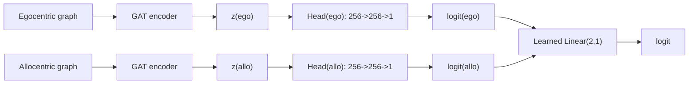

### 4.5 Scheme E — Cross-attentive fusion

*Rationale: tests whether letting each view's contribution be
dynamically reweighted in light of the other view — rather than fixed,
independently-computed contributions (C, D) — captures interactions
between the two that simple concatenation or logit-averaging cannot.*

The two projected graph vectors are treated as a two-token sequence and
allowed to attend to each other before classification:

$$
T = \big[\, \text{proj}(z^{ego}) \,;\, \text{proj}(z^{allo}) \,\big] \in \mathbb{R}^{2 \times 256}
$$
$$
T' = \text{MultiHeadAttention}_{H=2}(Q{=}T, K{=}T, V{=}T)
$$
$$
z = \text{flatten}(T') \in \mathbb{R}^{512}, \qquad \text{logit} = \text{Head}(z)
$$

Attention heads $H=2$ (over the 2-token sequence, per-head dimension
$256/2=128$); classifier input width $d_{in}=512$.

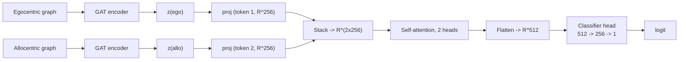

### 4.6 Scheme F — Unified graph fusion

*Rationale: tests whether letting the two views exchange information as
early as the first message-passing layer — rather than only after each
is fully, independently encoded (C, D, E) — captures cross-view
structure the other fusion schemes structurally cannot reach.*

The two graphs are **merged into one heterogeneous graph before
encoding** — building node types kept distinct per source graph to
avoid a naming collision, plus one new edge relation directly linking
each location's viewpoint node to its own focal node:

$$
G^{unified} = \text{Merge}(G^{ego}, G^{allo}), \qquad
z = z^{unified} \in \mathbb{R}^{256}, \qquad \text{logit} = \text{Head}(z^{unified})
$$

A single shared encoder ($d_h{=}128$, $H{=}4$ heads, $L{=}2$ layers,
same as every other scheme) processes the merged graph — now $10$
node types and $\sim 12$ edge relations total — in one pass, so
cross-graph information can mix as early as the first message-passing
layer, not just at the readout or classifier stage. Classifier input
width $d_{in} = 256$.

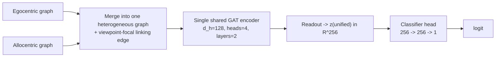

### 4.7 Scheme G — Non-graph tabular baseline

*Rationale: the non-graph control condition — tests whether graph
**structure** itself (which relation connects which entity to which)
is what drives any predictive advantage over the same raw content
presented as a conventional flat feature vector.*

The only scheme that discards graph structure entirely: every node's
raw features across both graphs are flattened into one fixed-length
row per location (counts, means, and summary statistics per node
type), and a gradient-boosted decision tree ensemble replaces the
entire encoder/readout/head stack:

$$
\phi_i = \text{Flatten}(G^{ego}_i, G^{allo}_i) \in \mathbb{R}^{d_{tab}}, \qquad
\hat{y}_i = \text{GBT}(\phi_i)
$$

| Parameter | Value |
|---|---|
| Ensemble size | $200$ trees |
| Maximum tree depth | $4$ |
| Split objective | PR-AUC-oriented boosting objective |

This scheme exists to test whether graph **structure** (which relation
connects which entity to which) contributes predictive value beyond
what the same raw information provides when presented as an
unstructured feature vector.

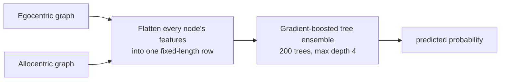

### 4.8 Summary

| Scheme | Graph(s) used | Fusion mechanism | Classifier input $d_{in}$ |
|---|---|---|---|
| A | Egocentric only | — | $256$ |
| B | Allocentric only | — | $256$ |
| C | Both | Concatenation (early fusion) | $512$ |
| D | Both | Learned logit combination (late fusion) | $2 \times 256$ (2 heads) + Linear(2,1) |
| E | Both | Cross-attention (2-token, 2 heads) | $512$ |
| F | Both, merged pre-encoding | Shared single encoder | $256$ |
| G | Both, flattened | Feature concatenation, no graph | tabular row (200-tree GBT, depth 4) |

---

## 5. Training Procedure

Every scheme (§4) is trained under an identical procedure, so that any
difference in final performance between schemes is attributable to the
fusion mechanism itself rather than to a difference in how each was
trained. For each scheme, the pooled dataset is split randomly into
train, validation, and test partitions at a $75\%/15\%/10\%$ ratio,
stratified on the binary label only — not on city, road type, or any
other attribute — and this split-train-evaluate cycle is repeated $5$
independent times with a fresh random split each time, so that reported
performance reflects a distribution across re-splits rather than a
single lucky (or unlucky) partition.

Within each repeat, the model is optimized with AdamW (learning rate
$1\times10^{-3}$, weight decay $1\times10^{-3}$), with the learning
rate reduced on a validation-metric plateau (patience $3$ evaluation
rounds). Training runs for a fixed budget of $100$ epochs with **no**
warm-up period and, deliberately, **no early stopping**: the patience
parameter is set greater than or equal to the epoch budget by
construction, so every repeat trains the full $100$ epochs regardless
of validation performance along the way, rather than stopping early at
a variable point. This is a deliberate choice to isolate
capacity/architecture effects from stopping-time variance — a scheme
that converges faster is not given a training-time advantage over one
that converges slower, since both simply run to the same fixed budget.
Loss is computed in mixed precision (bfloat16) throughout, and the
decision threshold applied to the model's output probability is held
fixed at $0.5$ for every scheme, so threshold-tuning is never a
confound in the fusion-mechanism comparison either.

Model selection happens at two nested levels. Within a repeat, the
single epoch whose validation accuracy is highest is the one whose
weights are kept — validation accuracy is the primary model-selection
metric throughout this study, not a proxy metric like PR-AUC or loss.
Across the $5$ repeats for a given scheme, only the single
best-performing repeat's weights are retained as that scheme's final
model; this is the specific checkpoint that the explanation stage (§7)
later analyzes, not an ensemble or average across repeats.

| Parameter | Value |
|---|---|
| Data split ratio (train / val / test) | $75\% / 15\% / 10\%$ |
| Split strategy | random, stratified on label only, repeated over $5$ independent re-splits |
| Optimizer | AdamW |
| Learning rate | $1\times10^{-3}$ |
| Weight decay | $1\times10^{-3}$ |
| LR schedule | reduce-on-plateau, patience $= 3$ evaluation rounds |
| Epoch budget | $100$ epochs, strictly (early stopping structurally disabled — patience $\geq$ epoch budget) |
| Warm-up epochs | $0$ |
| Model-selection metric (primary) | validation accuracy |
| Decision threshold | fixed at $0.5$ |
| Mixed precision | enabled (bfloat16) |
| Repeats per scheme | $5$ |

**Compute environment.** All training was carried out on Google Colab,
using the **High-RAM** runtime option paired with an **NVIDIA A100**
GPU — chosen specifically for this pipeline's memory footprint (the
heterogeneous, multi-relation graph batches and the pooled multi-city
dataset held in memory during training) and to keep the fixed $100$
epoch $\times$ $5$ repeat $\times$ seven-scheme training budget within a
practical wall-clock time.

**Software and key libraries.** Listed below are the libraries specific
to this pipeline's less-common stages — general-purpose data-science
packages (array/dataframe handling, standard ML metrics, plotting) are
omitted as implementation detail, not because they're unused:

| Pipeline stage | Key library / package |
|---|---|
| Street-level image acquisition (§2.1) | [`streetlevel`](https://github.com/sk-zk/streetlevel) |
| Panoptic segmentation (§2.3.1) | `transformers` (Mask2Former, Mapillary Vistas v1.2 checkpoint) |
| Allocentric geometry, OSM fetch (§2.4.1) | `osmnx` (including its `STRtree` spatial index for isovist ray-casting) |
| Street-network centrality metrics (§2.4.1) | `networkx` (via `osmnx`) |
| Graph representation and modeling (§3) | PyTorch, PyTorch Geometric (`GATv2Conv`, `HeteroConv`, `SortAggregation`) |

---

## 6. Evaluation Metrics

Reported per scheme, per split (validation and test), aggregated across
the $5$ repeats as mean $\pm$ standard deviation:

$$
\text{Accuracy} = \frac{TP+TN}{TP+TN+FP+FN}, \qquad
\text{Precision} = \frac{TP}{TP+FP}, \qquad
\text{Recall} = \frac{TP}{TP+FN}
$$
$$
F_1 = 2 \cdot \frac{\text{Precision} \cdot \text{Recall}}{\text{Precision} + \text{Recall}}
$$

alongside threshold-independent ranking metrics: **PR-AUC** (area under
the precision-recall curve, appropriate under class imbalance) and
**AUROC** (area under the receiver-operating-characteristic curve).

---

## 7. Post-hoc Explainability

Two complementary techniques are applied to the same trained model,
answering different questions.

### 7.1 Attention-Based Explanation

Since every message-passing layer already computes attention
coefficients $\alpha_{uv}^{r}$ (§3.2, $H{=}4$ heads, $L{=}2$ layers)
as part of ordinary inference, these can be read out directly, at zero
additional cost, layer by layer, relation by relation, head-averaged
to one scalar per edge. They answer: *"which neighbors did the model
attend to at each layer?"*

**Caveat established empirically in this study**: attention weights are
strongly shaped by node degree — a node with only one or two neighbors
under a relation is mechanically forced toward attention values near
$1/|\mathcal{N}|$ (e.g. exactly $0.5$ for two neighbors), regardless of
what the model actually learned. Attention alone should therefore be
treated as a *supplementary* signal, not the primary importance
measure.

### 7.2 Perturbation-Based Explanation (Learned Mask)

The primary importance signal is a **GNNExplainer-style learned soft
mask** (Ying et al., 2019), adapted to this heterogeneous, multi-relation
setting. For one already-trained, frozen model and one input graph, a
small set of new parameters — one importance value per node (and,
where applicable, per edge) — is optimized so that masking the input by
these values reproduces the model's own original prediction as closely
as possible, while staying sparse and confident:

$$
M^{node}_v = \sigma(\theta^{node}_v) \in [0,1], \qquad
\tilde{x}_v = x_v \cdot M^{node}_v
$$

with the model weights held fixed throughout, and $\theta$ optimized by
gradient descent (Adam) against:

$$
\mathcal{L}_{mask} = \underbrace{\text{BCE}\big(f(\tilde{G}),\, f(G)\big)}_{\text{fidelity}} \; + \; \lambda_{node} \sum_v M^{node}_v \; + \; \lambda_{edge} \sum_e M^{edge}_e \; + \; \lambda_{H}\, \mathcal{H}(M)
$$

| Parameter | Value |
|---|---|
| Optimizer | Adam |
| Learning rate | $0.05$ |
| Optimization steps (epochs) per explained point | $100$ |
| Node/feature sparsity coefficient $\lambda_{node}$ | $0.005$ |
| Edge sparsity coefficient $\lambda_{edge}$ | $0.005$ |
| Entropy coefficient $\lambda_H$ | $0.1$ |

where the fidelity term pushes the masked prediction to match the
model's *own* original prediction (not the ground-truth label), the
$\ell_1$-style sparsity terms encourage sparse masks, and $\mathcal{H}$
is an entropy penalty pushing every mask value toward a confident $0$
or $1$ rather than an ambiguous $0.5$. This objective is solved the
same way the model itself was trained — iterative gradient descent —
because it has no closed-form solution: the fidelity term depends on
the mask through the entire nonlinear forward pass.

For **dual-graph schemes (C, D, E)**, each branch is explained
separately, holding the other branch's (unmasked) input fixed, so that
"how important was this node to the *egocentric* branch's
contribution" is never conflated with the allocentric branch's
contribution.

**Optional finer granularity**: rather than one mask value per node,
the same mechanism can instead learn one mask value per **named input
feature component** (e.g. distinguishing a building's footprint area
from its height, rather than only "this building node"), by applying
$M$ to the raw, pre-projection feature vector at the granularity of its
named constituent fields — every continuous field individually
($1$ mask value each), every categorical field's whole embedding block
as one shared unit ($1$ mask value covering all $4$–$32$ embedding
dimensions, since sub-embedding-dimension masking is not independently
interpretable). Same optimizer/learning-rate/epoch/coefficient values
as the node-level case above.

### 7.3 Sampling and Aggregation Strategy

Because the mask-learning step is a per-point optimization, it is run
over a **sample** of points per scheme rather than the full test set —
covering all four prediction-outcome categories (true positive, true
negative, false positive, false negative) rather than correct
predictions alone, since explaining *errors* is what reveals whether a
model's mistakes stem from attending to the wrong evidence versus a
genuine calibration issue. Sample size per category is a free
parameter, chosen to balance statistical stability of the resulting
per-type averages against the linear compute cost of the optimization
above (each sampled point costs $100$ Adam steps through the frozen
model).

Point-level results are then aggregated into scheme-level summaries —
mean importance per node/edge type (or, at the finer granularity, per
named feature component) across all sampled points for that scheme —
enabling direct, scheme-to-scheme comparisons ("does scheme C rely on
building density more than scheme B does") rather than only isolated,
single-point case studies.

### 7.4 Choosing Explanation Depth: Two Options

§7.2's node/edge-level mask and its "optional finer granularity"
extension are not required to run together — they represent two
genuinely separate options, differing in what question they can answer
and what they cost:

| | **Option 1 — node/edge-level** | **Option 2 — adds feature-level** |
|---|---|---|
| Importance reported per | node (and edge, where applicable) | Option 1's granularity, **plus** one value per named feature component within each node (e.g. a building's `height` vs. its footprint `area`, separately) |
| GNNExplainer optimizations per sampled point | $1$ | $2$ — Option 1's run, plus a second, independent optimization over per-feature-component masks |
| Relative compute cost | baseline | $\approx 2\times$ baseline |
| Answers | "which node/edge did the model rely on" | Option 1's question, **plus** "which specific attribute of that node did it rely on" |
| Use when | a scheme-to-scheme or type-to-type comparison is the goal | a claim needs to be made at the level of one specific measured attribute, not just "this node type mattered" |

Both options explain the **same** trained model and the **same**
sampled points — Option 2 does not replace Option 1's output, it adds
a second, finer-grained report alongside it (§7.2's "optional finer
granularity" paragraph gives the exact masking mechanism). Choosing
Option 2 is a deliberate cost/granularity tradeoff, not a strictly
better default: run Option 1 alone when the reporting question stays
at the node/edge-type level, and add Option 2 specifically when a
finer, attribute-level claim is needed.

---

## 8. Summary of the Full Pipeline

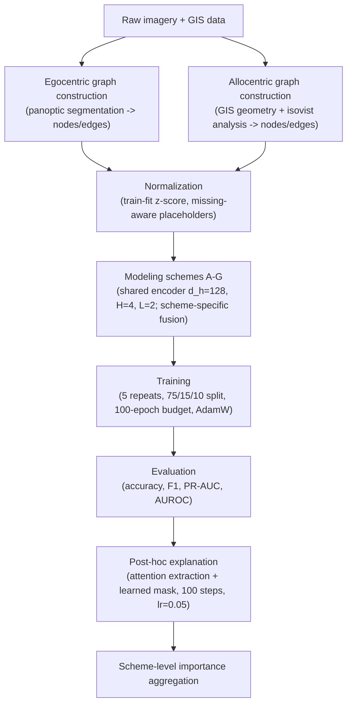
