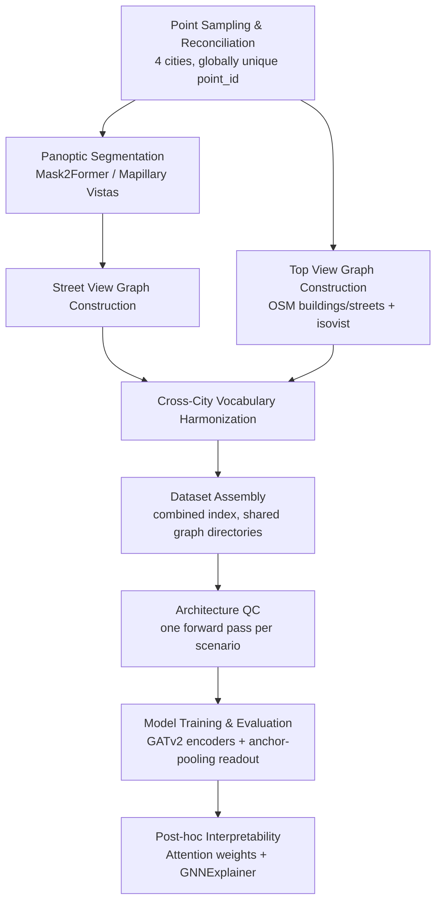
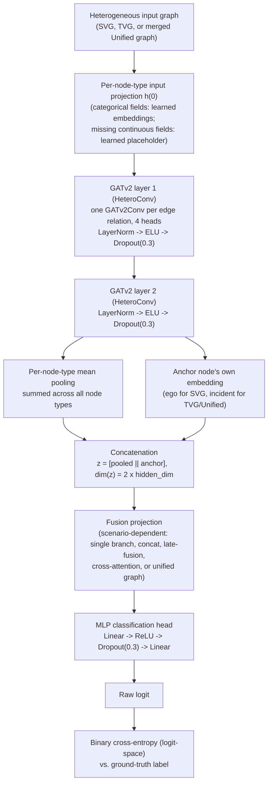

# Materials and Methods

> Numbers marked **[REPORT FROM RUN LOGS]** are configured targets, not
> measured outputs — this repository's notebooks are not executed here,
> so final sample sizes, class balance, and result figures must be
> pulled from actual run logs (`dataset_index.parquet`,
> `metrics_capacity_revision/*.csv`) before submission. Every threshold,
> formula, and hyperparameter below was verified against the current
> source code, not reconstructed from memory.

## Overview

This study proposes a dual-graph heterogeneous graph attention network
for point-level traffic-crash risk classification (incident vs.
non-incident), combining an egocentric **Street View Graph (SVG)** and
an allocentric **Top View Graph (TVG)** per candidate location. Both
graphs are encoded by a Graph Attention Network v2 (GATv2) stack and
collapsed to a fixed-size representation via **anchor-pooling** — a
sum of per-node-type mean pools concatenated with the anchor node's own
embedding, guaranteeing that the incident location's own representation
always reaches the classifier. In addition to this primary
architecture, a controlled ablation examines whether an explicit
historical-crash-proximity signal — a `peer_incident` node type and
`crash_history` edge relation connecting each point to nearby prior
crashes — improves prediction beyond the point's own physical and
visual features (§8).

*Figure 1. End-to-end pipeline, from raw point sampling to the final
interpretability pass.*

## 1. Study Areas and Point Sampling

Four urban study areas were used: Bogor (Indonesia), Warsaw (Poland),
Kraków (Poland), and Somerville (Massachusetts, USA), selected to span
distinct street-network typologies, building densities, and traffic
contexts. Each candidate location contributed one incident coordinate
(used for all geometric processing) and one paired street-view image (a
single, forward-facing crop, not a full panorama).

Every candidate point was reconciled against its metadata and confirmed
image availability via inner join; points failing any check were
dropped. Negative (non-crash) points were sampled to match the positive
(crash) set's road/highway-type distribution rather than uniformly at
random, avoiding a road-type confound given that highway type is later
used as a model feature. Every point received a globally unique,
city-prefixed identifier (`bog_`, `war_`, `kra_`, `som_`) at this stage,
so that all four cities' data could subsequently be pooled into one
combined dataset without collision.

**Target sample size** [REPORT FROM RUN LOGS]: ≈2,200 positive and
≈2,200 negative points, pooled across all four cities; final N depends
on reconciliation yield and downstream graph-construction success
(§6).

## 2. Street-View Graph (SVG) Construction

Panoptic segmentation was performed with Mask2Former
(`facebook/mask2former-swin-large-mapillary-vistas-panoptic`), trained
on the Mapillary Vistas v1.2 taxonomy (65 classes) (Cheng et al., 2022;
Neuhold et al., 2017).

**Nodes (6 types).** `ego` (one per graph; features: sky-view factor,
enclosure index, Shannon entropy of the segmentation, fixed viewpoint
position) and five object types — `signage`, `light_pole`,
`road_marking`, `building`, `vegetation` — each carrying normalized
centroid position and normalized area. Object instances were split from
Mask2Former's "thing" detections directly, or from "stuff" segments via
connected-component labeling. Minimum retained object area was 0.08% of
image area for signage/light_pole/road_marking, and 5% for
building/vegetation.

**Edges (3 relations, bidirectional where noted).**

| Relation | Trigger | Edge feature |
|---|---|---|
| `sees` (bidirectional) | `ego` ↔ every object node | area, distance/diagonal |
| `mounted_with` | centroid distance ≤ 0.04 × image diagonal (bounding-box overlap is **not** required) | bounding-box overlap ratio |
| `near` (bidirectional) | centroid distance ≤ 0.175 × image diagonal | distance/diagonal |

`mounted_with` connects `signage`↔`signage`, `light_pole`↔`light_pole`,
and `signage`↔`light_pole` pairs only.

## 3. Top-View Graph (TVG) Construction

Each point's allocentric surroundings were represented from
OpenStreetMap building footprints and street topology, combined with an
isovist computed at the incident coordinate: 360 rays cast to a 50 m
radius against a spatial index of building boundaries.

**Nodes (4 types).** `incident` (one per graph; fractional position
along its nearest road segment, isovist area/compactness/openness,
highway type) · `building` (area, perimeter, circular compactness,
elongation, orientation, shape index, building type, height/level
count with explicit missing-value flags) · `intersection` (betweenness
centrality, orientation entropy) · `peer_incident`
(**ablation-only**, constant placeholder).

**Inclusion rule.** A building or intersection enters the graph if and
only if it is spatially covered by the incident's isovist polygon — no
road-edge endpoints are force-included.

**Edges (6 relations).**

| Relation | Trigger | Edge feature |
|---|---|---|
| `anchors` (bidirectional) | `incident` ↔ every included building/intersection | distance (m) |
| `adjacent` | 5 nearest other included buildings, by real centroid distance (not a full clique) | distance (m) |
| `connects` | real OSM street edges between included intersections | highway type, maxspeed, oneway |
| `fronts` | building → its nearest included intersection | distance (m) |
| `on_segment` (bidirectional) | `incident` ↔ its nearest road edge's two endpoints | distance, highway type, maxspeed, oneway |
| `crash_history` (**ablation-only**) | `incident` → every other **positive-label, same-city** point within 100 m | distance (m) |

The `crash_history` relation deliberately excludes negative-label
points (a non-crash point can never be "peer evidence" for crash
history) and carries no train/validation/test split awareness — it is
computed once, at dataset-construction time, from the full reconciled
point table.

## 4. Cross-City Vocabulary Harmonization

Building-type and highway-type categorical vocabularies were built
independently per city, then unioned into one shared vocabulary before
any pooled experiment. Every already-constructed TVG graph's stored
categorical indices were remapped to the unified vocabulary (geometry
was not recomputed); every city's cache was spot-checked for agreement
before use.

## 5. Dataset Assembly

A point entered the final dataset only if both its SVG and TVG graphs
constructed and loaded successfully. All four cities' graphs were
written into one shared directory pair, indexed by one combined table
carrying `city` and `label` columns and keyed by each point's globally
unique `point_id`.

## 6. Model Architecture

Both SVG and TVG (and, for the unified-graph configuration, their
merge) are encoded by an independent heterogeneous graph attention
network, then collapsed to a fixed-size vector by anchor-pooling,
projected into a shared fusion space, and classified by a small MLP
head.

*Figure 2. Per-branch encoder-to-loss data flow for the proposed
anchor-pooling variant.*

### 6.1 Graph attention encoding

For each layer $\ell = 1, 2$:

$$h^{(0)}_v = \text{InputProj}_{\tau(v)}(x_v), \qquad
h^{(\ell)} = \text{Dropout}_{0.3}\Big(\text{ELU}\big(\text{LayerNorm}(\text{HeteroConv}^{(\ell)}(h^{(\ell-1)}))\big)\Big)$$

where $\tau(v)$ is node $v$'s type and each `HeteroConv` layer applies
one GATv2Conv (Brody et al., 2022) per edge relation (4 attention
heads, head dimension = hidden_dim/4, edge features included where
available), with per-relation outputs summed at shared destination node
types. Hidden dimension was 128 for every encoder.

### 6.2 Anchor-pooling readout

The final layer's per-node embeddings $h^{(2)}$ are reduced to one
fixed-size graph vector by summing a mean pool over every node type and
concatenating the anchor node's own embedding:

$$z = \Big[\ \sum_{\tau} \text{MeanPool}\big(\{h^{(2)}_v : \tau(v) = \tau\}\big)\ \Big\Vert\ h^{(2)}_{\text{anchor}}\ \Big], \qquad \dim(z) = 2\cdot\text{hidden\_dim} = 256$$

where the anchor is `ego` for the SVG encoder and `incident` for the
TVG and unified-graph encoders. By construction, $z$ **always**
includes the anchor node's own representation, regardless of how the
rest of the graph is structured or how many nodes of each type are
present — the incident location's own features can never be
outvoted or diluted out of the final representation.

For node types with zero instances in a given graph (e.g. a point with
no detected signage), that type contributes a zero vector to the sum
rather than being omitted, so $\dim(z)$ is identical across every graph
regardless of its specific node-type composition.

### 6.3 Fusion and classification

Every branch's anchor-pooled output $z \in \mathbb{R}^{256}$ was
projected into a 256-dimensional fusion space, combined according to
the evaluated fusion scheme (Table 1), and classified by a 2-layer MLP:

$$\text{logit} = W_2\,\text{Dropout}_{0.3}\big(\text{ReLU}(W_1 z_{\text{fused}} + b_1)\big) + b_2, \qquad W_1 \in \mathbb{R}^{256\times256}$$

*Table 1. Fusion schemes evaluated.*

| Scheme | Mechanism |
|---|---|
| SVG only | Single branch |
| TVG only | Single branch |
| Concatenation | $[\text{proj}(z_{\text{svg}}) \Vert \text{proj}(z_{\text{tvg}})] \to$ head |
| Late fusion | Independent heads → logits $\ell_s,\ell_t$; learned combination $w_1\ell_s + w_2\ell_t$ |
| Cross-attention | $z_{\text{svg}}, z_{\text{tvg}}$ as two tokens, self-attend, concatenate → head |
| Unified graph | SVG and TVG merged into one heterogeneous graph pre-encoding, single encoder |
| Tabular baseline | Flattened scene/isovist/count features → gradient-boosted trees (XGBoost), no graph structure |

## 7. Training Procedure

Every fusion scheme was trained independently, end to end, for 5
independent repeats of a 70/15/15 train/validation/test split
(stratified by label only, drawn fresh each repeat; no city-level
stratification). Continuous node features were $z$-scored using
statistics fit on each repeat's training partition only, never
refit on validation/test data.

*Table 2. Training hyperparameters.*

| Parameter | Value |
|---|---|
| Optimizer | AdamW, learning rate $5\times10^{-3}$, weight decay $1\times10^{-4}$ |
| Loss | Binary cross-entropy on raw logits (numerically stable logit-space formulation) |
| LR schedule | Reduce-on-plateau (factor 0.5), monitoring the primary metric, patience 8 epochs, after a 20-epoch warm-up |
| Epoch budget | **150 epochs, strictly** — early stopping was structurally disabled (patience ≥ epoch cap) so training duration could not confound the ablation comparison |
| Model-selection / primary metric | **Accuracy**, evaluated on the held-out validation split each epoch |
| Decision threshold | Fixed at 0.5 |
| Batch size | 128 |
| Repeats | 5, independently re-split |

Checkpoint selection used only validation-split performance; test data
never influenced which epoch's weights were kept.

## 8. Ablation: Historical Crash-Proximity Signal

Every TVG-containing fusion scheme (TVG-only, concatenation, late
fusion, cross-attention, and the unified graph) was additionally
trained with one extra node type and edge relation enabled — both
already introduced in §3 as **ablation-only** and excluded from the
primary architecture by default:

- **`peer_incident`** — a constant-placeholder node, added once per
  every *other* point that qualifies as a historical peer of the point
  being classified.
- **`crash_history`** — a directed edge from `incident` to every
  qualifying `peer_incident`, carrying the real distance (m) between
  the two locations.

A candidate point qualifies as a peer if and only if it (a) carries a
**positive** (crash) label — a non-crash point can never stand in as
"crash-history evidence" — (b) lies in the **same city** as the point
being classified, and (c) falls within **100 m** of it. This relation
is computed once, at dataset-construction time, from the full
reconciled point table, independent of any later train/validation/test
split.

**Why this is evaluated as an ablation rather than folded into the
primary architecture.** `crash_history` deliberately encodes each
point's proximity to *other, already-labeled* crash locations — a
signal that can trivially correlate with the target label wherever
crashes cluster geographically, without necessarily generalizing to
genuinely novel locations no historical crash has yet been recorded
near. It is reported as a separate, explicitly flagged condition (each
scheme's "+" variant, e.g. concatenation+, late-fusion+) so that any
gain it provides is visible and attributable to this one relation,
rather than silently baked into the primary model's headline numbers.

Every other hyperparameter (Table 2) and every other architectural
component (§6) was held identical between each scheme's base and "+"
variant, isolating `peer_incident`/`crash_history` as the only
explanatory difference within each pair.

## 9. Model Interpretability

Two complementary post-hoc techniques were applied to trained
checkpoints, sampled across true-positive, true-negative,
false-positive, and false-negative predictions:

1. **Attention-weight extraction** — GATv2's learned per-neighbor
   attention coefficients were read directly from each trained layer,
   at no additional computational cost.
2. **A GNNExplainer-style learned mask** (Ying et al., 2019) — a
   per-point optimization that learns soft node- and edge-importance
   masks maximizing agreement between the masked and original
   predictions while encouraging sparsity, answering which specific
   nodes/edges drove a given prediction rather than only which
   neighbors received attention at each layer. Applied here to confirm
   empirically that the anchor node's *learned* importance is
   consistent with the *architectural* guarantee built into
   anchor-pooling (§6.2) — i.e. that the incident location's own
   features are not merely present in $z$ by construction, but
   genuinely contribute to the model's decision.

## 10. Software and Computational Environment

Python 3.11, PyTorch and PyTorch Geometric (`GATv2Conv`, `HeteroConv`),
scikit-learn, SciPy, XGBoost, GeoPandas/Shapely/OSMnx, Hugging Face
Transformers (Mask2Former). Training was performed on Google Colab
GPUs with bfloat16 mixed precision; graph construction was CPU-only. A
global random seed of 42 was used throughout, with a per-repeat offset
for every repeated procedure.

## References

- Brody, S., Alon, U., & Yahav, E. (2022). How Attentive are Graph
  Attention Networks? *International Conference on Learning
  Representations (ICLR)*.
- Cheng, B., Misra, I., Schwing, A. G., Kirillov, A., & Girdhar, R.
  (2022). Masked-attention Mask Transformer for Universal Image
  Segmentation. *CVPR*.
- Neuhold, G., Ollmann, T., Rota Bulò, S., & Kontschieder, P. (2017).
  The Mapillary Vistas Dataset for Semantic Understanding of Street
  Scenes. *ICCV*.
- Ying, R., Bourgeois, D., You, J., Zitnik, M., & Leskovec, J. (2019).
  GNNExplainer: Generating Explanations for Graph Neural Networks.
  *NeurIPS*.
