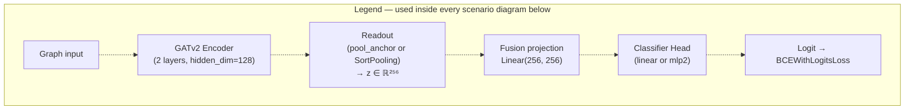
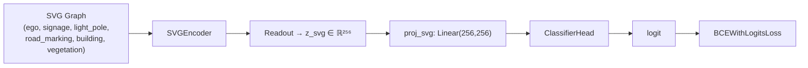
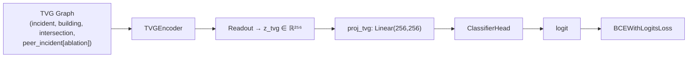
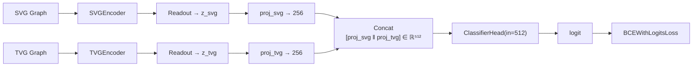
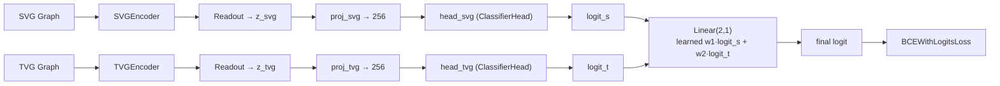
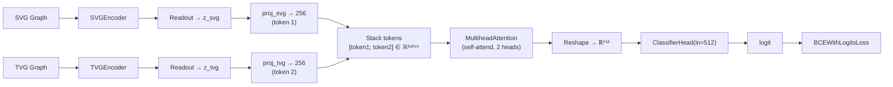
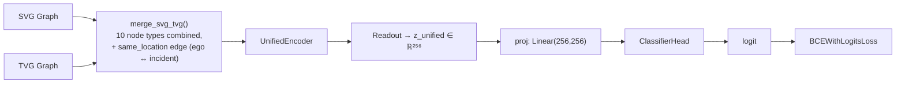
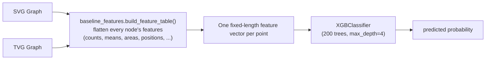

# Fusion Scenario Architectures — Input to Output, A Through G

One diagram per scenario, each traced from raw graph input to the final
prediction. Every scenario shares the same building blocks (defined
once here, referenced by name in every diagram below) — only how they're
wired together differs.

## Shared building blocks

**GATv2 Encoder** (`SVGEncoder` / `TVGEncoder` / `UnifiedEncoder`,
`src/models.py`): 2 `HeteroConv` layers, one `GATv2Conv` per edge
relation per layer, `hidden_dim=128`, 4 attention heads, categorical
fields (object class, building type, highway type) through learned
embeddings, `LayerNorm → ELU → Dropout(0.3)` per layer.

**Readout**: collapses the encoder's per-node output into one
`z ∈ ℝ²⁵⁶` graph-level vector. Two interchangeable options (the only
axis that differs between `07g` and `07i` — see
`docs/07g_07i_architecture.md`):
- `pool_anchor` (default): `[Σ mean-pool per node type ‖ anchor node's own embedding]`
- `dgcnn` (SortPooling): rank all nodes by salience, keep top-`k`, `Conv1d → MaxPool1d → Conv1d → Linear`

**Classifier Head** (`ClassifierHead`, `depth="mlp2"` in `07g`/`07i`):
`Linear(in, 256) → ReLU → Dropout(0.5) → Linear(256, 1)` → one raw logit.

**Loss**: `BCEWithLogitsLoss` against the binary incident/non-incident label.

---

## Scenario A — SVG only

Single branch. The street-view graph alone decides the prediction.

## Scenario B — TVG only

Single branch. The top-view graph alone decides the prediction.

## Scenario C — Dual graph, concatenation (early fusion)

Both branches encoded independently, then concatenated before the head sees either one.

## Scenario D — Dual graph, late fusion

Both branches get their **own independent classifier head**, producing
two logits; a small learned layer decides how much to trust each.

## Scenario E — Dual graph, cross-attention

Both branches' embeddings become two tokens that attend to each other
before the head — tests whether each branch's relevance depends on the
other's context.

## Scenario F — Unified merged graph

SVG and TVG are merged into **one heterogeneous graph** *before*
encoding (not after) — `building` renamed `svg_building`/`tvg_building`
to avoid a name collision, plus a new `same_location` edge connecting
each point's `ego` node to its own `incident` node. One shared encoder,
one readout, one head.

## Scenario G — Tabular baseline (no graph, no GNN)

The only non-GNN scheme. Every node's features across both graphs are
flattened into one fixed-length row per point; a gradient-boosted tree
ensemble replaces the entire encoder/readout/head stack. Exists to test
whether graph *structure* adds value over the same raw information
presented flat.

---

## Summary table

| Scenario | Input graph(s) | Encoder(s) | Fusion mechanism | Head |
|---|---|---|---|---|
| A | SVG only | 1× SVGEncoder | — | ClassifierHead(256) |
| B | TVG only | 1× TVGEncoder | — | ClassifierHead(256) |
| C | SVG + TVG | SVGEncoder + TVGEncoder | Concatenation | ClassifierHead(512) |
| D | SVG + TVG | SVGEncoder + TVGEncoder | Learned logit combination | 2× ClassifierHead(256) + Linear(2,1) |
| E | SVG + TVG | SVGEncoder + TVGEncoder | Cross-attention (2 tokens) | ClassifierHead(512) |
| F | SVG ∪ TVG (merged) | 1× UnifiedEncoder | Pre-encoding graph merge | ClassifierHead(256) |
| G | SVG + TVG (flattened) | — (no GNN) | Feature concatenation | XGBoost (200 trees) |

Every scenario except G shares: `hidden_dim=128`, 2 GATv2 layers,
`fusion_dim=256`, `head_depth="mlp2"`, `head_hidden=256`,
`head_dropout=0.5`, and the same `readout` choice (`pool_anchor` for
`07g`, SortPooling for `07i`) — the fusion mechanism in the table above
is the only structural difference between A–F.
